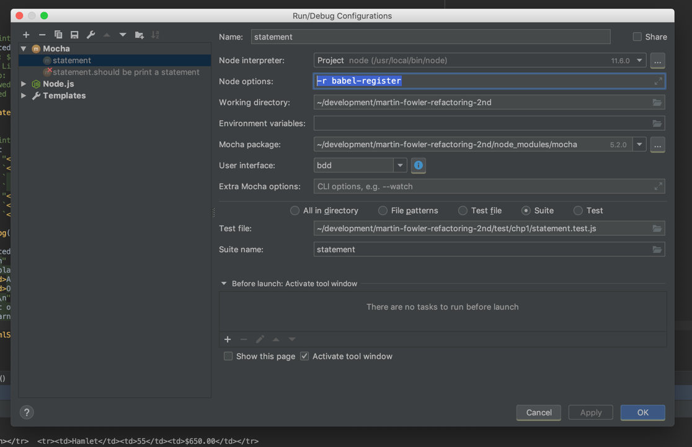

# martin-fowler-refactoring-2nd
Practice refactoring techniques in the Martin Fowler's Refactoring 2nd edition

## Yarn

This project is dependent on the package manager [Yarn](https://yarnpkg.com/en/docs/install).
You need to install it before you can set up the project

## If you want to simply set up a JS project from scratch where you can write JS code, tests and run the test

Create a root directory on your computer for your project. In the root directory of your project, 
run the following commands:

``` sh
 yarn init
 yarn add --save-dev mocha chai babel-register babel-preset-es2015
```

Open up package.json and set your test script to the following: 

  "scripts": {
    "test": "mocha --watch --recursive --require babel-core/register"
  },


Create a .babelrc file in the project directory:

```
{
  "presets": ["es2015"]
}
```


## Set up project: 

This project is dependent on the package manager [Yarn](https://yarnpkg.com/en/docs/install).

In the root directory of your project, run the following commands:

``` sh
 yarn
```

## Run tests:

In the root directory of your project, run the following commands:

``` sh
  yarn test
```

## Setup JetBrain's WebStorm to run test:

In the run configuration dialog have the following line for the Node options field:

```
-r babel-register
````

